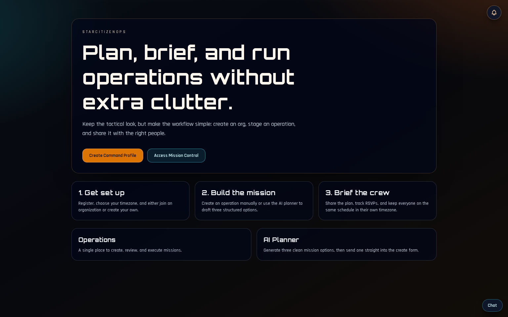
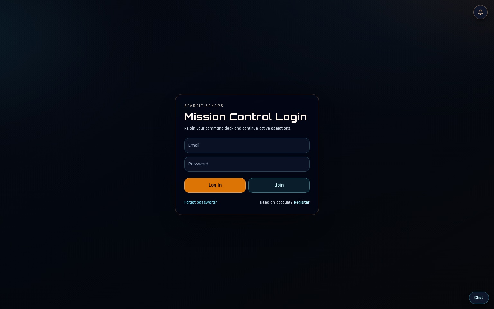
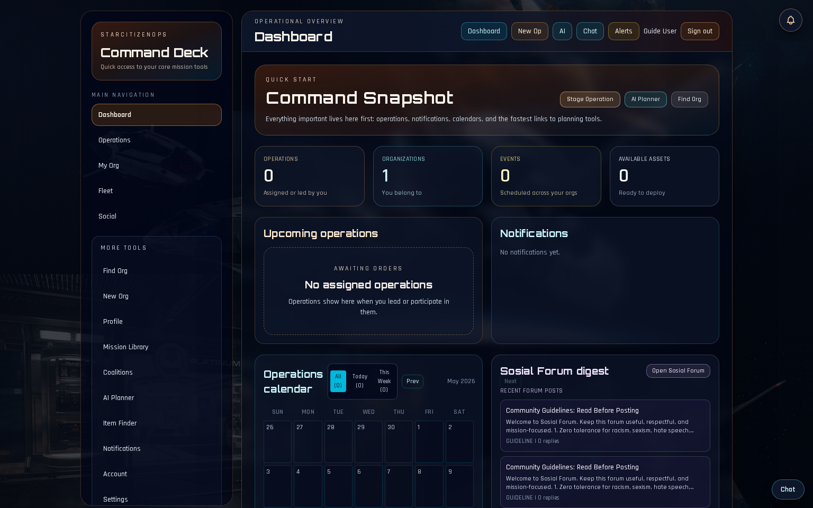

# StarCitizenOps User Guide

This guide walks you through the core workflow in StarCitizenOps: signing in, navigating the dashboard, joining organizations, planning missions, and running operations.

## 1. Landing Page

Start at the home page to access the two main entry points:
- Create an account
- Log in to Mission Control

### What to do here
1. If you are new, click **Create Command Profile**.
2. If you already have an account, click **Access Mission Control**.

## 2. Login

Use your account email and password on the login screen.

### Login checklist
1. Enter your account email.
2. Enter your password.
3. Click **Log In**.
4. If enabled for your account, complete 2FA.

## 3. Dashboard (Mission Control)

After logging in, you land on the dashboard. This is your command center.

### What you can do from the dashboard
1. Review upcoming operations and readiness.
2. Check approvals and pending requests (if you are in leadership roles).
3. Open notifications and activity updates.
4. Navigate to missions, organizations, fleet, and settings from the shell navigation.

## 4. Organizations and Join Applications

### Joining an organization
If you are not a member of an organization, open an organization page and submit the short application form.

The form requires:
1. Star Citizen username
2. Preferred role
3. Weekly availability
4. Why you want to join
5. Optional additional notes

### For organization leaders
Leaders can:
1. Review incoming applications
2. Approve/reject requests
3. Edit the application prompt text shown to applicants
4. Reset prompts back to defaults with one click

## 5. Missions and Operations

### Missions
Use the **Missions** area to browse mission templates and select mission types for planning.

### Operations
Use **Operations** to:
1. Create new operations
2. Set objectives, start time, threat level, and logistics details
3. Coordinate participants and readiness

## 6. Settings and Security

Use **Settings** to manage:
1. Profile details
2. Timezone (important for operation times)
3. Security options (including 2FA)
4. Discord account linking and org-level Discord integration (if configured)

## 7. Discord Integration (If Your Org Uses It)

Organization leaders can configure Discord to:
1. Post operation alerts
2. Support RSVP actions from Discord
3. Run slash commands
4. Sync org roles

Use the built-in **Test Connection** to verify:
1. Guild access
2. Channel access
3. Message/embed posting
4. Role API access

## 8. Star Citizen 4.8 Data Update Notes

The app has been updated for the Star Citizen **4.8** data set used by the local mission sync and fleet setup workflows.

### Fleet data updates
1. The ship catalog includes **Tiburon** support.
2. Requested Star opps fleet setup is:
3. Freelancer x1
4. Tiburon x1
5. F7C Hornet x2
6. Perseus x1

### Mission data updates
1. Mission templates are synced from the real-contract seed library.
2. Mission source metadata now includes a 4.8 version marker.
3. Use the mission sync script after pulling updates to refresh template data in the database.

## Useful Tips

1. Set your timezone first. It makes operation times and calendars much easier to trust.
2. Keep your Star Citizen handle accurate. It helps org leaders verify and place you faster.
3. Use concise operation objectives. Clear one-line objectives improve team response.
4. For org leaders, keep application prompts specific. Good prompts reduce low-quality join requests.
5. Test Discord config before relying on alerts. A quick test prevents missed operation pings.
6. Use Missions first, then create operations. Template-driven planning is faster and more consistent.

## Quick Start Path

1. Register account
2. Join or create organization
3. Set timezone and profile basics
4. Browse missions
5. Create operation
6. Invite/assign participants
7. Track execution from dashboard
